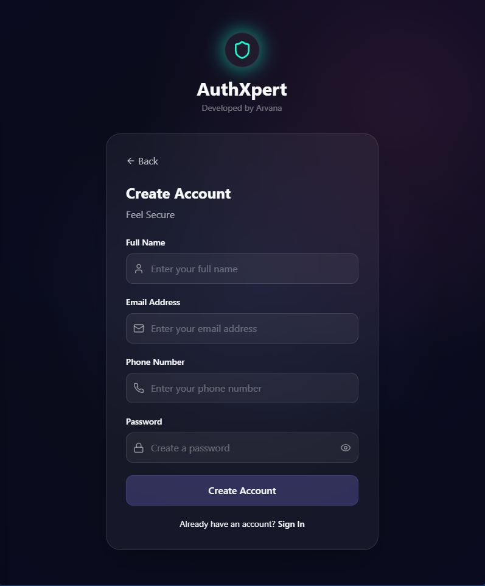
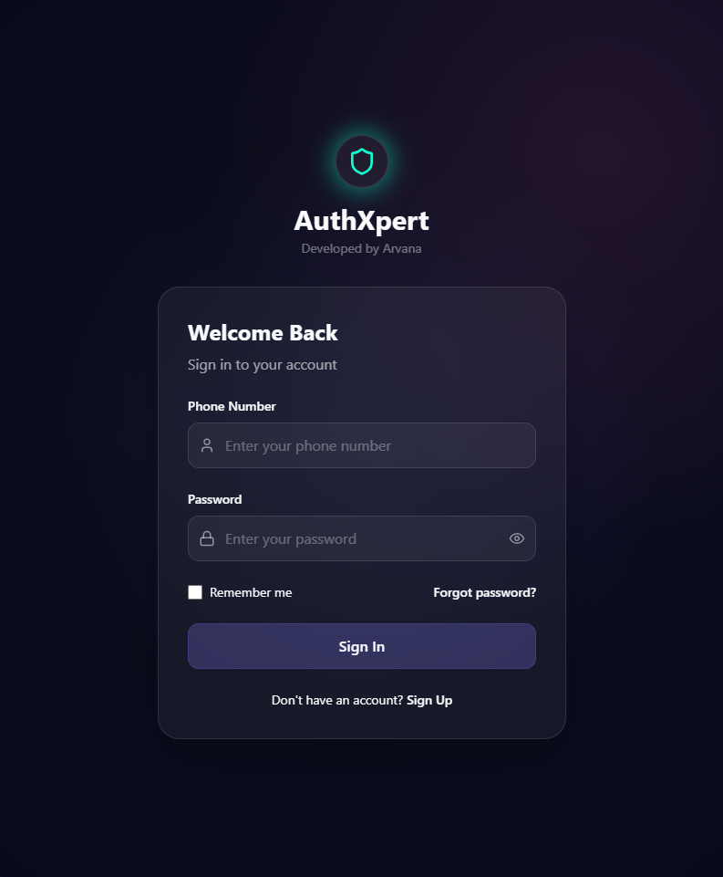
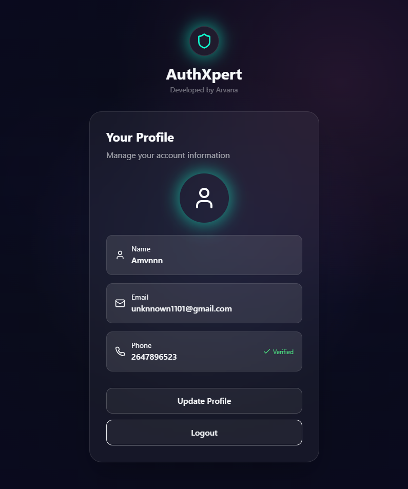
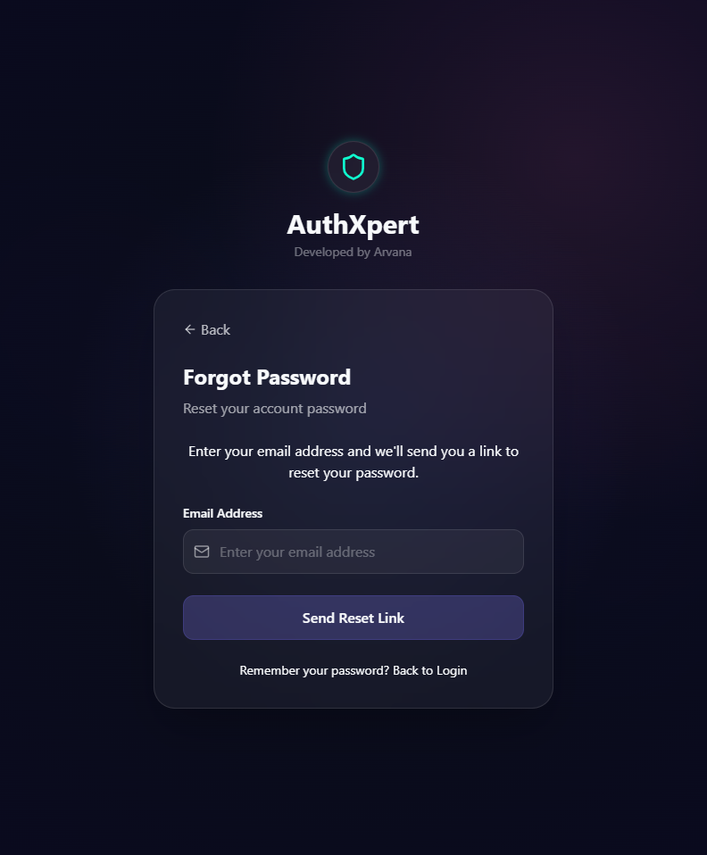

## AuthXpert - Secure User Authentication System

> A fully featured, secure, and production-ready authentication system built with **Node.js**, **Express.js**, and **MongoDB**. Supports OTP verification, JWT-based login, password reset, and user profile management.

---

###  Screenshots

  
  
  
  
  

---

##  Features

- Email-based **OTP Verification**
- **JWT-based login** (secure + stateless)
- Password encryption using **bcrypt**
- Resend OTP with **rate limiting**
- **Forgot password** via OTP → token-based reset
- User CRUD: update, delete, get profile
- Middleware-based **route protection**
- Mongoose schema with UUID, timestamp, and auto-expiry indexing
- Organized **MVC file structure**

---

##  Tech Stack

- **Backend**: Node.js, Express.js
- **Database**: MongoDB + Mongoose
- **Security**: bcrypt, JWT, OTPs, expiry indexing
- **UUID**: `uuidv4` for User ID
- **Validation**: validator.js

---

##  Auth API Routes

###  Public Routes

| Method | Route                  | Description                      |
|--------|------------------------|----------------------------------|
| POST   | `/api/auth/register`   | Register user & send OTP         |
| POST   | `/api/auth/login`      | Login with email & password      |
| POST   | `/api/auth/verify-otp` | Verify OTP sent during register  |
| POST   | `/api/auth/resend-otp` | Resend OTP (limited by count)    |
| POST   | `/api/auth/forgot-password` | Request OTP for password reset |
| POST   | `/api/auth/verify-reset-otp` | Verify reset password OTP     |
| PATCH  | `/api/auth/reset-password/:token` | Set new password using token |

###  Protected Routes (Require JWT)

| Method | Route                 | Description                       |
|--------|-----------------------|-----------------------------------|
| GET    | `/api/auth/me`        | Get current user details          |
| PATCH  | `/api/auth/update-me` | Update current user profile       |
| PATCH  | `/api/auth/update-password` | Update password (current → new) |
| DELETE | `/api/auth/delete-me` | Soft delete (set `active = false`) |

---

## Credits
Built under Arvana


##  How to Use

### 1. Clone the Repository

```bash
git clone https://github.com/yourusername/auth-api.git
cd auth-api
npm install
Create .env file with 
 - PORT = Desired port
 - MONGO_URI = your_mongoDB_uri
 - JWT_SECRET = WAKALALA (anything)
 - JWT_EXPIRES_IN = 2d (any duration)
npm start ("http://localhost:5000/api/auth/")
 
